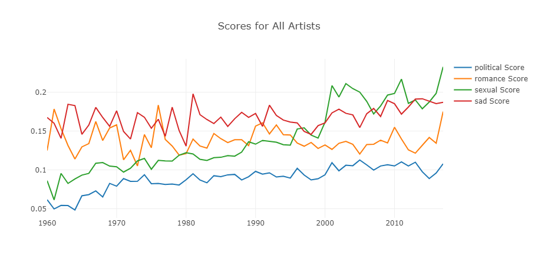
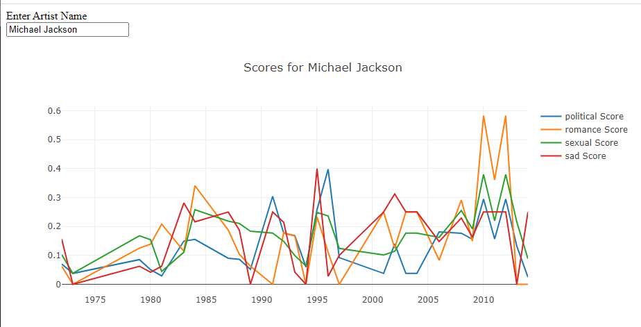
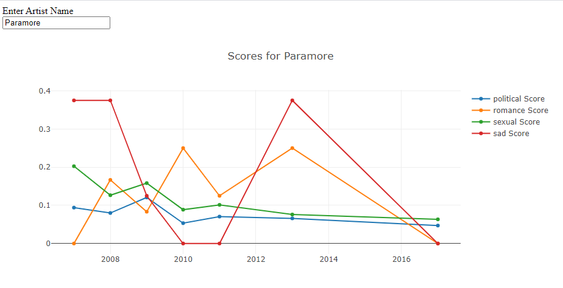
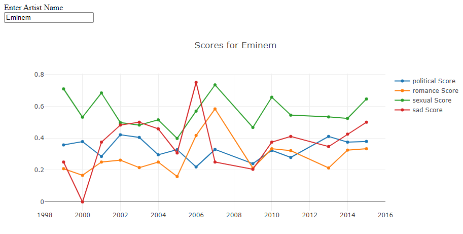
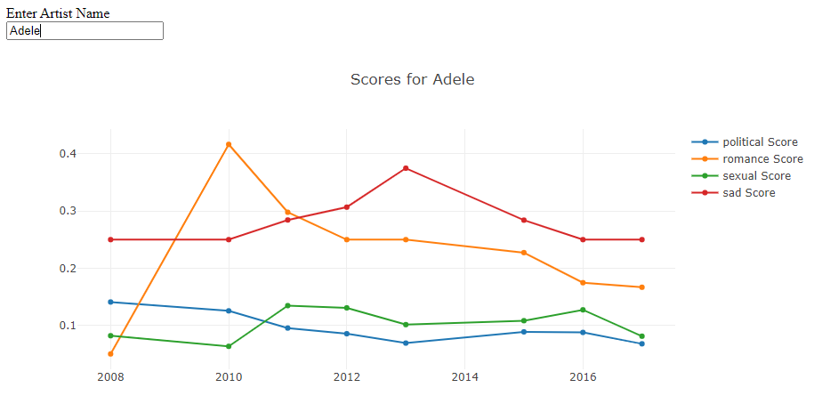
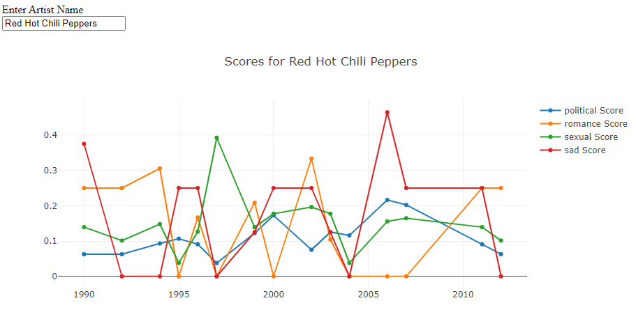
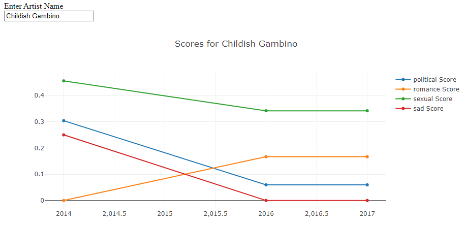

## What is this?

This is a pet project aimed to expose interesting patterns and trends within pop culture and society over time. Using song lyrics from top 40's hits between the 1960's to the present, I wanted to build a fun and interesting look into how our culture has evolved over the years. What did we most care about 20 years ago versus today? What are some themes that we have in common? Where is the future of music (and society?) going?

WIP Visualizations as Examples

